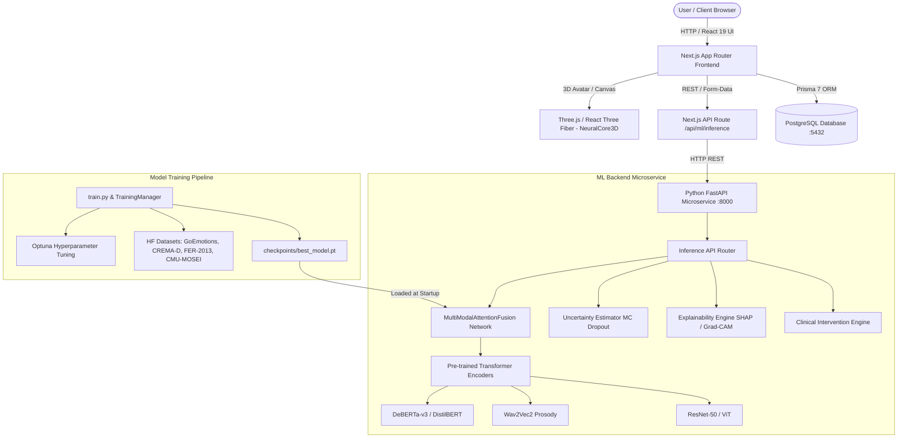

# UA-EDT: Uncertainty-Aware Emotion Digital Twin
## Comprehensive Technical Project Overview & Architecture Guide

---

### Executive Summary

**UA-EDT (Uncertainty-Aware Emotion Digital Twin)** is an advanced, multimodal AI ecosystem designed to estimate, track, and contextualize human emotional states in real-time. By integrating **Text**, **Audio (Voice Prosody)**, and **Vision (Facial Action Units)**, UA-EDT constructs a dynamic **Digital Twin** avatar that reflects emotional trajectories along with mathematically rigorous **confidence scores** and **epistemic uncertainty bounds**.

Unlike traditional "black-box" emotion classification models, UA-EDT provides:
1. **Multimodal Fusion**: Cross-attention mechanism to fuse heterogeneous sensory inputs and handle missing modalities.
2. **Uncertainty Quantification**: Monte Carlo (MC) Dropout and Temperature Scaling to measure prediction entropy and prevent overconfident false classifications.
3. **Explainable AI (XAI)**: Token-level SHAP attributions, Grad-CAM facial activation maps, and modality weighting graphs.
4. **Clinical-Grade Intervention Engine**: Evidence-based therapeutic guidance (CBT, MBSR, Somatic Grounding) dynamically tailored to the user's emotional state, confidence level, and risk triage status.

---

## 1. High-Level Architecture & Component Connections

The platform is structured as a decoupled microservices architecture with a Next.js web application frontend, a PostgreSQL database managed via Prisma ORM, and a dedicated Python FastAPI Machine Learning microservice.



---

## 2. Technology Stack & Frameworks

| Domain | Technologies & Libraries | Purpose & Details |
| :--- | :--- | :--- |
| **Frontend Framework** | Next.js 16.2 (App Router), React 19, TypeScript | Modern server/client web architecture, route handlers, server actions. |
| **Styling & Animation** | Tailwind CSS v4, Framer Motion, Lucide React | Glassmorphism UI design system, fluid state transitions, responsive dashboards. |
| **3D & Visualization** | Three.js, `@react-three/fiber`, `@react-three/drei`, Recharts | Interactive 3D Digital Twin neural core avatar, historical emotion trend charts. |
| **Database & ORM** | PostgreSQL 15, Prisma 7, `@prisma/client`, `@auth/prisma-adapter` | Relational storage for digital twin state, user sessions, datasets, predictions, and model metadata. |
| **Authentication** | NextAuth.js v4, bcryptjs | User authentication, session management, role-based access control (USER / ADMIN). |
| **ML Microservice** | Python 3.10+, FastAPI 0.103, Uvicorn | High-performance asynchronous API endpoints for real-time model inference. |
| **Deep Learning** | PyTorch 2.0, Torchvision 0.15, Torchaudio 2.0, Transformers 4.33 | Neural network design, tensor operations, pre-trained model fine-tuning. |
| **Acoustic & Image Processing** | Librosa 0.10, PySoundFile, OpenCV, Pillow | Speech waveform resampling (16kHz), band-pass filtering, face alignment & normalization. |
| **Calibration & XAI** | Optuna, SHAP 0.42, Grad-CAM, Scikit-Learn | Hyperparameter search, feature attribution scoring, calibration reliability curves. |
| **Infrastructure** | Docker, Docker Compose | Multi-container setup (`db`, `web`, `ml-backend`) with optional NVIDIA GPU passthrough. |

---

## 3. Datasets Used & Data Preprocessing Pipelines

UA-EDT leverages premier benchmark datasets across all three modalities:

### 3.1 Datasets Breakdown

1. **Text Modality**:
   - **GoEmotions (Google)**: 58,000 Reddit comments labeled across fine-grained emotion categories, simplified to standard basic emotions.
   - **Emotion Dataset (HuggingFace/bhadresh-savani)**: Twitter text labeled for 6 core affect states (sadness, joy, love, anger, fear, surprise).

2. **Audio Modality (Speech Prosody)**:
   - **CREMA-D (Crowd-sourced Emotional Multimodal Actors Dataset)**: 7,442 audio clips from 91 actors across diverse ethnic backgrounds uttering sentences with specific emotions.
   - **IEMOCAP (Interactive Emotional Dyadic Motion Capture)**: Multimodal dyadic conversations for speech pitch, energy, and prosodic contour extraction.

3. **Vision Modality (Facial Expressions)**:
   - **AffectNet / FER-2013**: ~30,000 facial images categorized into 7 basic facial expression action units (Joy, Sadness, Anger, Fear, Surprise, Disgust, Neutral).

4. **Multimodal Triplet Benchmark**:
   - **CMU-MOSEI**: Benchmark dataset containing aligned monologue video, audio, and text transcripts with emotional ratings.

### 3.2 Preprocessing Pipelines

- **Audio Denoising & Filtering (`preprocess_audio_denoise`)**:
  - Resampling input audio files to **16 kHz**.
  - Band-pass filtering (80 Hz to 8000 Hz) to eliminate low-frequency room rumbles and high-frequency acoustic artifacts.
  - Peak amplitude normalization.
- **Visual Face Alignment (`preprocess_face_align`)**:
  - Centered bounding box cropping to isolate facial action units.
  - Image resizing to **$224 \times 224$ pixels** and ImageNet channel normalization ($\mu=[0.485, 0.456, 0.406]$, $\sigma=[0.229, 0.224, 0.225]$).
- **Text Normalization**:
  - Lowercasing, token stripping, stop-word preservation for emotional nuance, and tokenization using DeBERTa/DistilBERT subword tokenizers.

---

## 4. Machine Learning Model Architecture & Multimodal Fusion

### 4.1 Modality-Specific Feature Encoders

1. **Text Encoder**: DeBERTa-v3 (`microsoft/deberta-v3-small`) or DistilBERT (`distilbert-base-uncased-emotion`), mapping sequence tokens into a 768-dimensional feature embedding $\mathbf{E}_{\text{text}} \in \mathbb{R}^{1 \times 768}$.
2. **Audio Encoder**: Wav2Vec2 (`facebook/wav2vec2-base-960h` / `ehcalabres/wav2vec2-lg-xlsr-en-speech-emotion-recognition`), extracting acoustic feature maps into $\mathbf{E}_{\text{audio}} \in \mathbb{R}^{1 \times 768}$.
3. **Vision Encoder**: ResNet-50 / ViT (`microsoft/vit-base-patch16-224`) extracting spatial facial feature maps into $\mathbf{E}_{\text{vision}} \in \mathbb{R}^{1 \times 768}$.

### 4.2 Multi-Head Cross-Attention Fusion (`MultiModalAttentionFusion`)

To combine disparate modality representations adaptive to quality or missing modalities, UA-EDT employs a **Cross-Attention Fusion Layer**:

$$\mathbf{H}_{m} = \text{Dropout}(\text{ReLU}(\text{LayerNorm}(\mathbf{W}_{m} \mathbf{E}_{m} + \mathbf{b}_{m}))), \quad m \in \{\text{text}, \text{audio}, \text{vision}\}$$

Where all modality vectors are projected to a unified space $d_{\text{proj}} = 256$.

```
Text Embedding (768d)  ---> Projection Head (256d) ---\
Audio Embedding (768d) ---> Projection Head (256d) ----+---> [Stacked Embeddings (3 x 256d)]
Vision Embedding (768d)---> Projection Head (256d) ---/                  |
                                                                         v
                                                       Query, Key, Value Projections
                                                                         |
                                                                         v
                                                       Scaled Dot-Product Attention:
                                                       Score = (Q * K^T) / sqrt(d)
                                                                         |
                                                                         v
                                                       Missing Modality Mask (-1e9)
                                                                         |
                                                                         v
                                                       Softmax Modality Weights
                                                                         |
                                                                         v
                                                       Fused Vector (256d) -> Classifier -> Logits (7 Emotions)
```

**Handling Missing Modalities**:
If a modality (e.g. image) is missing during inference, the attention mask sets that channel's attention score to $-\infty$ (or $-10^9$) prior to Softmax, ensuring the network dynamically recalculates weights strictly among active modalities without crashing or producing dummy outputs.

---

## 5. Model Training, Calibration & Optimization

### 5.1 Discriminative Layer Unfreezing

Training proceeds in progressive stages (`setup_backbone_unfreezing`) to preserve pre-trained transformer features while adapting to emotion targets:
- **Stage 0 (Epochs 1-30%)**: Freeze pre-trained backbones; train only projection layers ($\mathbf{W}_m$) and classification heads.
- **Stage 1 (Epochs 30-60%)**: Unfreeze attention Query/Key/Value layers.
- **Stage 2 (Epochs 60-100%)**: Full end-to-end fine-tuning with Cosine Annealing learning rate schedule.

### 5.2 Optimization & Loss Function

- **Loss Function**: Weighted Cross-Entropy Loss to counter class imbalance in emotional benchmarks:
  $$L = -\sum_{c=1}^{C} w_c \cdot y_c \log(\hat{y}_c)$$
- **Optimizer**: AdamW ($\text{lr} \in [10^{-5}, 10^{-3}]$, $\text{weight\_decay} \in [10^{-6}, 10^{-2}]$).
- **Mixed Precision**: Accelerated training via `torch.cuda.amp.autocast` and `GradScaler`.
- **Hyperparameter Optimization**: **Optuna** automatically samples hyperparameter combinations across $N$ trials to minimize validation loss.

---

## 6. Uncertainty Estimation & Explainable AI (XAI)

### 6.1 Monte Carlo (MC) Dropout & Temperature Calibration

To calculate predictive uncertainty:
1. **Monte Carlo Dropout**: During inference, dropout layers remain active (`model.train()` for dropout only). The model runs $T=15$ stochastic forward passes for a single input.
2. **Temperature Scaling**: Logits are scaled by temperature $T = 1.15$ to adjust confidence calibration:
   $$\hat{P}(Y=c | X) = \frac{\exp(z_c / T)}{\sum_{j} \exp(z_j / T)}$$
3. **Predictive Entropy Calculation**:

   $$H(Y|X) = -\sum_{c=1}^{C} \bar{P}_c \log(\bar{P}_c)$$

4. **Normalized Uncertainty Score**:

   $$\text{Uncertainty} = \min\left( \frac{H(Y|X)}{\ln(C)}, 1.0 \right) \times 100\%$$

### 6.2 Explainability Engine (XAI)

- **SHAP (Shapley Additive exPlanations)**: Measures token-level marginal contributions to text emotion scores, identifying positive and negative trigger words.
- **Grad-CAM (Gradient-weighted Class Activation Mapping)**: Maps gradient activations back to visual region channels (e.g. Zygomaticus Major for Joy, Corrugator Supercilii for Sadness/Anger).
- **Attention Allocation Matrix**: Returns percentage weights showing how much each modality influenced the final prediction (e.g., Text: 52%, Audio: 31%, Vision: 17%).

---

## 7. Evidence-Based Clinical Intervention System

The `InterventionEngine` converts raw emotion classifications and uncertainty bounds into evidence-based therapeutic recommendations:

```
                  ┌───────────────────────────────┐
                  │ Emotion + Confidence +        │
                  │ Uncertainty + Risk Level      │
                  └───────────────┬───────────────┘
                                  │
                       Is Uncertainty > 70%?
                     ┌────────────┴────────────┐
                    YES                        NO
                     │                         │
      ┌──────────────┴─────────────┐  ┌────────┴─────────────────────┐
      │ High Uncertainty Fallback  │  │ Map Emotion to Evidence-     │
      │ Request Context / Tone     │  │ Based Protocol               │
      └────────────────────────────┘  └────────┬─────────────────────┘
                                               │
                                      Apply Risk Level Modifier
                                   ┌───────────┼───────────┐
                                  LOW        MEDIUM       HIGH
                                   │           │           │
                             Standard      Moderate     Critical
                             Baseline      Alert        Crisis Line
```

| Emotion | Clinical Protocol | Evidence Base |
| :--- | :--- | :--- |
| **Joy** | Positive affect capitalization, reflective journaling | Positive Psychology: Fredrickson's Broaden-and-Build Theory (1998) |
| **Sadness** | Behavioral activation, 10-min walk, 4-7-8 breathing | Cognitive Behavioral Therapy (CBT) |
| **Anger** | Progressive Muscle Relaxation (PMR), cognitive reappraisal | Beck's Cognitive Therapy (1979) |
| **Fear** | 5-4-3-2-1 Somatic sensory grounding | Mindfulness-Based Stress Reduction (MBSR) |
| **Surprise** | Schema integration & novelty orientation | Cognitive Schema Theory |
| **Disgust** | Boundary identification & avoidance vectoring | Affective Science Boundary Protocols |

---

## 8. Database Schema & Data Models (Prisma ORM)

The PostgreSQL schema (`prisma/schema.prisma`) integrates NextAuth authentication with UA-EDT core models:

```prisma
model User {
  id           String        @id @default(cuid())
  name         String?
  email        String?       @unique
  role         String        @default("USER") // USER, ADMIN
  digitalTwin  DigitalTwin?
  predictions  Prediction[]
}

model DigitalTwin {
  id                 String   @id @default(cuid())
  userId             String   @unique
  user               User     @relation(fields: [userId], references: [id], onDelete: Cascade)
  currentEmotion     String?
  currentConfidence  Float?
  currentUncertainty Float?
  history            Json?    // Daily/weekly trend logs
  updatedAt          DateTime @updatedAt
}

model Prediction {
  id                 String   @id @default(cuid())
  userId             String
  modality           String   // TEXT, AUDIO, IMAGE, MULTIMODAL
  inputDataPath      String
  predictedEmotion   String
  confidence         Float
  uncertainty        Float
  explanationSummary String?  @db.Text
  explainabilityData Json?    // SHAP tokens, Grad-CAM weights
  modelUsed          String?
  createdAt          DateTime @default(now())
}

model Dataset {
  id          String        @id @default(cuid())
  name        String
  modality    String        // IMAGE, AUDIO, TEXT, MULTIMODAL
  status      String        @default("UPLOADED")
  models      ModelConfig[]
}

model ModelConfig {
  id           String   @id @default(cuid())
  name         String
  architecture String   // ResNet50, Wav2Vec2, DeBERTa, Fusion
  status       String   @default("CONFIGURED")
  metrics      Json?    // accuracy, f1, loss curves
  datasetId    String
}
```

---

## 9. Frontend Architecture & Interactive Components

- **Digital Twin 3D View (`NeuralCore3D.tsx`)**:
  - Interactive 3D Canvas built with React Three Fiber (`@react-three/fiber`) and Drei (`@react-three/drei`).
  - Animates a central sphere with custom shader-like material distortion and particle clouds reacting dynamically to emotion types (e.g. calm blue ambient glow for Neutral, warm energetic pulse for Joy, erratic intense aura for Anger).
- **Dashboard Hub (`DigitalTwin.tsx`)**:
  - Real-time display of current emotion state, confidence percentage gauge, uncertainty index, and trend metrics.
  - Integrated Recharts visualizer for tracking historical emotion fluctuations over time.
  - Active clinical intervention cards with actionable exercise steps.
- **Multimodal Analyzer (`AnalyzeEmotion.tsx`)**:
  - Tabbed interface allowing users to submit raw text, record or upload audio speech clips, or capture facial imagery.
  - Communicates directly with `/api/ml/inference`, rendering immediate SHAP attributions, confidence scores, and uncertainty warnings.

---

## 10. End-to-End Execution Flow (Data Journey)

```
[User submits Text / Audio / Image via UI]
                   │
                   ▼
  Next.js Proxy Handler: /api/ml/inference
                   │
                   ▼ (Forwards HTTP POST request)
  Python FastAPI Microservice: /predict/multimodal
                   │
  ┌────────────────┴────────────────┐
  │ 1. Preprocess & Extract Features│
  │    (Denoise, Align, Tokenize)   │
  └────────────────┬────────────────┘
                   │
  ┌────────────────┴────────────────┐
  │ 2. Forward Pass via             │
  │    MultiModalAttentionFusion    │
  └────────────────┬────────────────┘
                   │
  ┌────────────────┴────────────────┐
  │ 3. Monte Carlo Dropout          │
  │    (15 passes -> Mean + Entropy)│
  └────────────────┬────────────────┘
                   │
  ┌────────────────┴────────────────┐
  │ 4. Explainability Analysis      │
  │    (SHAP & Grad-CAM)            │
  └────────────────┬────────────────┘
                   │
  ┌────────────────┴────────────────┐
  │ 5. Clinical Intervention Mapping│
  └────────────────┬────────────────┘
                   │
                   ▼
  JSON Response Returned to Next.js Client:
  {
    "prediction": "Joy",
    "confidence": 94.2,
    "uncertainty": 5.1,
    "explanation": { "key_factors": ["happy", "great"], "method": "SHAP" },
    "intervention": { "recommendation": "Journal positive affect triggers...", ... }
  }
                   │
                   ▼
  UI Updates: 3D Core Aura Shifts, Charts Update, DigitalTwin Model Persisted to Database
```

---

## 11. Verification & Testing Tools

- **Unit & Integration Tests**: `ml-backend/tests` uses `pytest` to validate inference endpoint contracts, tensor dimensions, and missing-modality handling.
- **Evaluation Visualizations (`generate_evaluation_artifacts`)**:
  - `confusion_matrix.png`: Matrix evaluating true vs predicted emotion boundaries across test splits.
  - `reliability_diagram.png`: Calibration curves comparing mean predicted probability against empirical positive fractions.
  - `loss_accuracy_curves.png`: Epoch loss trajectories ensuring zero over-fitting.

---

### Summary Table: How Everything Connects

```
[ Data Inputs ] ---> [ Encoders ] ---> [ Cross-Attention Fusion ]
                           │                    │
                           ▼                    ▼
                    [ Modality Weights ]  [ MC Uncertainty ]
                           │                    │
                           └──────────┬─────────┘
                                      │
                                      ▼
             [ Prediction + Explainability + Clinical Intervention ]
                                      │
                                      ▼
            [ Prisma Database ] <---> [ Next.js 16 + R3F 3D Interface ]
```
